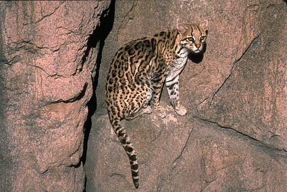
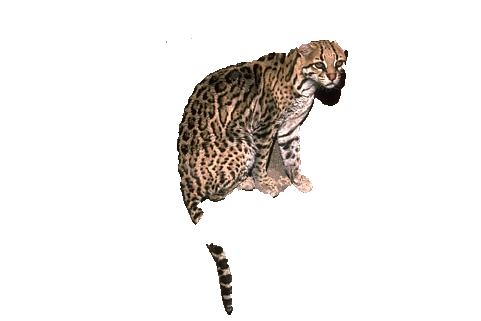

# OneCut - software for interactive image segmentation <br/>

	"Grabcut in One Cut"
	Meng Tang, Lena Gorelick, Olga Veksler, Yuri Boykov
	In IEEE International Conference on Computer Vision (ICCV), 2013.

Contact author: Meng Tang (mtang73@uwo.ca)

Example output of OneCut for interactive segmentation in a fraction of a second:<br />
<span>
</span>
```{r, engine='bash'}
load input image
Image width: 481
Image height: 321
Color bin size: 8
number of non-empty color bins: 1015
load bounding box
run maxflow/mincut
ibfsgraph->getFlow(): 5.67943e+007
save segmentation
saved into: images/326038_result.bmp
It takes 0.439 seconds!
errornum / boxsize 1775 58608
errorrate: 0.030286
```
Note that for solving maxflow in OneCut, we recommend the [IBFS](http://www.cs.tau.ac.il/~sagihed/ibfs/code.html) algorithm.
